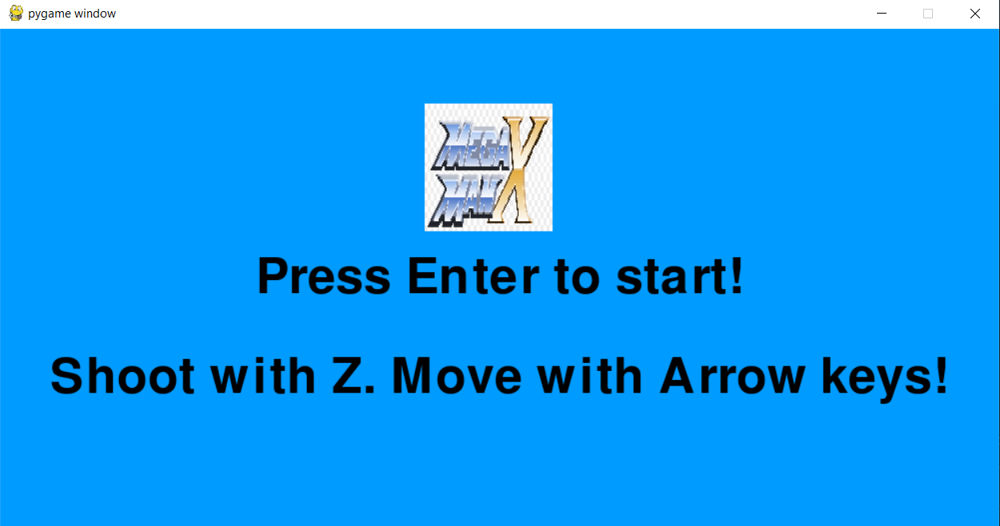
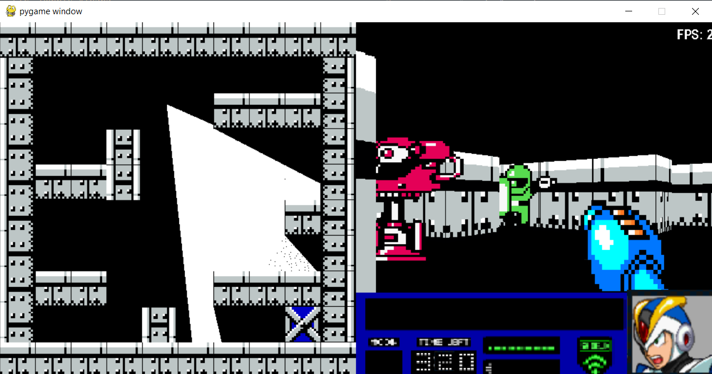
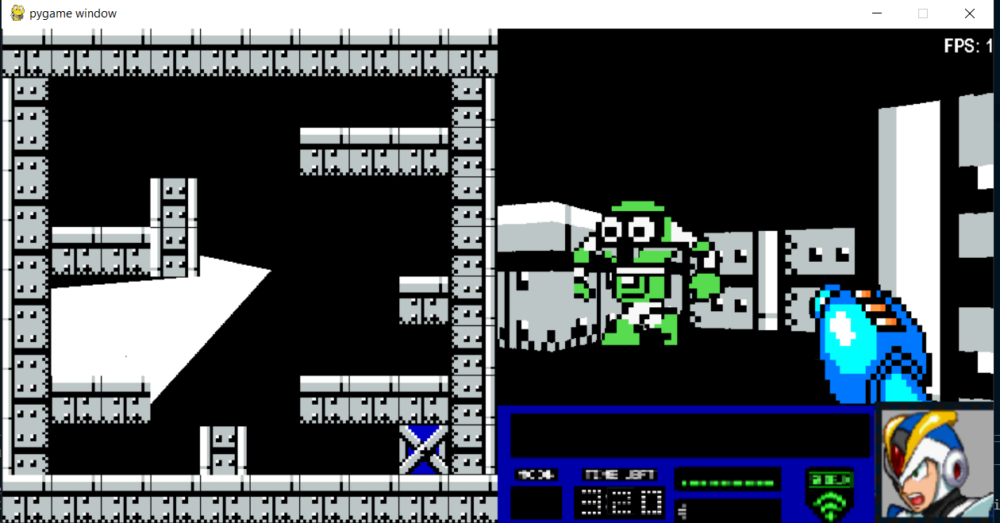

# graphics_Proyect3
El objetivo de éste proyecto es demostrar los conocimientos adquiridos durante la tercera parte del curso.

Los estudiantes deben entregar un Ray Caster simple (usando PyGame o SDL) que renderice un nivel entero y jugable.

## Screenshot 1

## Screenshot 2

## Screenshot 3

